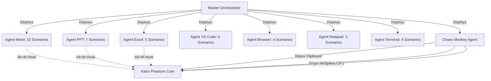

# 🧠 Kairo Phantom: Real-World 39-Scenario Testing Gauntlet Memory

> **FOR FUTURE AGENTS / IDEs (CURSOR, COPILOT, WINDSURF):**
> READ THIS FILE to understand the 39-scenario real-world GUI testing gauntlet architecture, execution flow, and testing criteria.

## 🏗️ 1. Gauntlet Architecture (The Graph)
The Kairo Phantom real-world testing gauntlet uses 8 parallel agents to physically open Microsoft Word, PowerPoint, Excel, VS Code, Chrome, Notepad, and Windows Terminal. It tests 39 distinct ghost-writing scenarios while under active Chaos Monkey suppression.



## 📋 2. The 39 Scenarios Breakdown
1. **Microsoft Word (W1-W10)**: Blank page creation, formatting improvement, grammar correction, table summary, tracked changes integration, large document 40+ page rewrites, multi-style preservation, tone shifting, structural restructuring, and broken formatting repair.
2. **Microsoft PowerPoint (P1-P7)**: 5-slide deck creation from scratch, visual design/consistency, text condensing to bullets, AI image generation, speaker notes generation, slide restructuring, and theme application.
3. **Microsoft Excel (E1-E5)**: Formula debugging (circular/#VALUE!), data analysis, chart creation, complex formula generation, and data cleaning.
4. **VS Code (V1-V6)**: Code generation from comments, refactoring, bug fixing, MCP server integration (Claude Code -> Kairo), multi-file context analysis, and unit test generation.
5. **Google Docs / Browser (G1-G4)**: Yjs CRDT peer collaboration, AI visibility/awareness, single Ctrl+Z atomic undo, and concurrent Human + AI editing conflict resolution.
6. **Notepad (N1-N3)**: Quick note expansion, OFFLINE mode (Ollama Llama-3 fallback), and text transformation (encoding fixes).
7. **Windows Terminal (T1-T4)**: Shell command generation, PowerShell deployment script generation, error explanation (ERESOLVE), and multi-step automated workflows.

## ⚙️ 3. Execution Engine
- **Master Script**: `orchestrate_39_scenarios_parallel.ps1`
- **Execution**: The master script deploys PowerShell background jobs (`Start-Job`) invoking Python `universal_orchestrator.py` for each specific application agent.
- **Criteria for Success**: ALL 39 scenarios must pass, 35+ on first attempt, no crashes, and chaos monkey active.

## 🚀 4. How to Run
```powershell
.\orchestrate_39_scenarios_parallel.ps1
```
