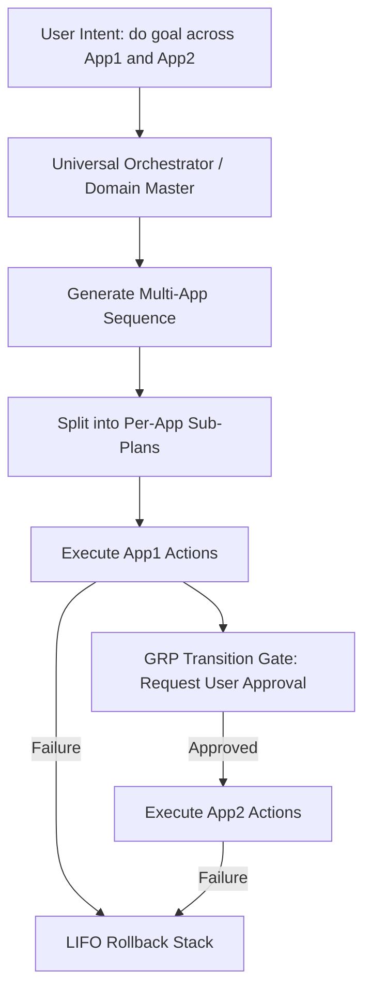

# Kairo Phantom — Cross-App CUA Workflow Design

This document details the architecture and roadmap for v0.2 Cross-App CUA Workflows.

## Overview

Cross-app CUA workflows allow Kairo Phantom to coordinate operations spanning multiple applications (e.g., extracting data from Chrome, formatting it in Excel, and pasting it as a summary in Word) using a unified intent.

The user triggers a cross-app command using the pattern:
```
// do [goal] across [app1] and [app2]
```

## Architectural Design



### 1. Multi-App Plan Generation
The Domain Master parses the compound intent and generates a unified `CuaPlan` containing metadata mapping specific action blocks to target applications.
- **Process Detection:** Matches active processes and resolves them to friendly app labels.
- **Template Blending:** Blends Excel templates, Word templates, and generic web interactions.

### 2. GRP Transition Gates
To prevent unexpected cross-app context switches and window-stealing, the Ghost Review Panel (GRP) enforces a hard transition gate:
- When switching from `App1` to `App2`, execution pauses.
- The GRP displays:
  ```
  Transitioning to App2.exe (Microsoft Excel)
  Kairo will:
    [1] Focus Excel window
    [2] Paste extracted data
  [Tab: Approve Transition] [Esc: Cancel]
  ```
- No automation is run in the new application until the user explicitly presses **Tab**.

### 3. Multi-App Rollback Support
The LIFO Rollback Stack tracks modifications across all involved applications:
- **Keystrokes:** Buffered per-app and undone via application-specific undo shortcuts (`Ctrl+Z`).
- **Files:** Pre-execution snapshots of all modified files across the workspace are stored and restored LIFO on sequence failure.
- **Safety Window:** Backups are retained in `~/.kairo-phantom/backups/` for 24 hours.
